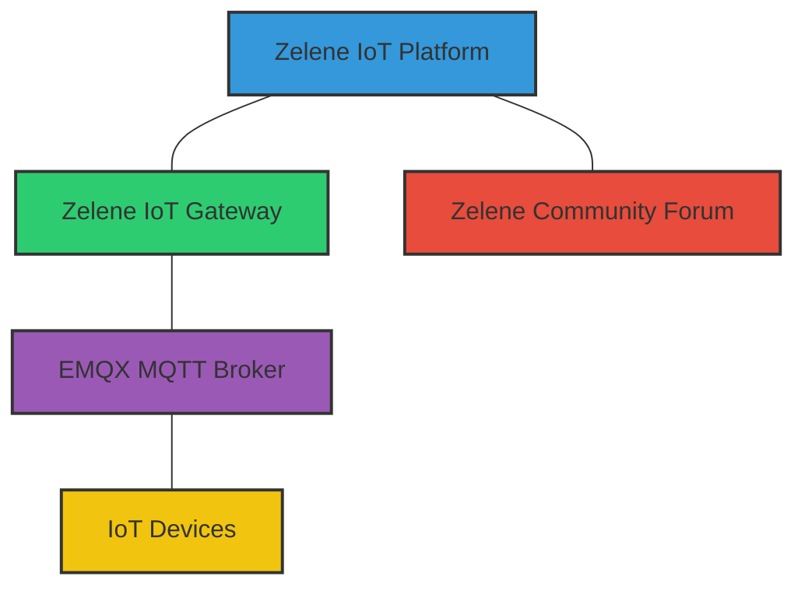
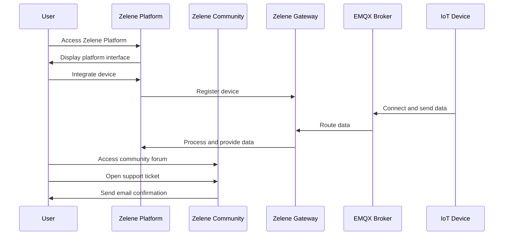

# Zelene IoT Platform

## Open-Source IoT Management for Small-Scale Deployments

Zelene is a comprehensive open-source IoT platform designed for small-scale deployments. Our integrated ecosystem provides a complete solution for IoT device management, data processing, visualization, and community support.

[](https://opensource.org/licenses/MIT)
[](https://github.com/ctp-swinburne/zelene-platform/stargazers)
[](https://github.com/ctp-swinburne/zelene-platform/issues)

## 🌟 Key Features

- **Device Management**: Register, monitor, and control IoT devices through a simple interface
- **Data Processing**: Automated data handling with the Zelene Gateway
- **MQTT Integration**: Built-in support for MQTT protocol via EMQX broker
- **Community Hub**: Integrated forum for documentation, support, and user feedback
- **Modern Stack**: Built with TypeScript, Next.js, and the T3 stack for a robust development experience

## 🧩 Platform Components

The Zelene ecosystem consists of four main components:



### Zelene IoT Platform
User interface for device integration, management, and data visualization.
[Repository](https://github.com/ctp-swinburne/zelene-platform)

### Zelene IoT Gateway
Backbone handling data flow, traffic management, and device control.
[Repository](https://github.com/ctp-swinburne/zelene-gateway)

### EMQX MQTT Broker
Message broker for IoT device communications.
[External Component](https://www.emqx.io/)

### Zelene Community Forum
Hub for user engagement, documentation, support, and feedback.
[Repository](https://github.com/ctp-swinburne/zelene-landing-pg)

## 📊 System Architecture



## 🚀 Getting Started

### Quick Start

1. Clone the repositories:
   ```bash
   git clone https://github.com/ctp-swinburne/zelene-platform.git
   git clone https://github.com/ctp-swinburne/zelene-gateway.git
   git clone https://github.com/ctp-swinburne/zelene-landing-pg.git
   ```

2. Set up the required environment variables (see documentation in each repository)

3. Install dependencies:
   ```bash
   # For Platform and Community
   cd zelene-platform && pnpm install
   cd zelene-landing-pg && pnpm install
   
   # For Gateway
   cd zelene-gateway && bun install
   ```

4. Start the development servers:
   ```bash
   # In each respective directory
   pnpm dev
   # or for Gateway
   bun run dev
   ```

For detailed deployment instructions, see our [Deployment Manual](link-to-deployment-manual).

## 🧰 Technology Stack

- **Frontend**: Next.js, TypeScript, Tailwind CSS
- **Backend**: tRPC, Prisma ORM
- **Authentication**: NextAuth.js with OAuth 2.0
- **Database**: PostgreSQL
- **Message Broker**: EMQX (MQTT)
- **Package Managers**: pnpm (Platform & Community), Bun (Gateway)

## 🤝 Contributing

We welcome contributions to the Zelene IoT Platform! Please see our [Contributing Guidelines](link-to-contributing) for more information.

## 📝 License

This project is licensed under the MIT License - see the [LICENSE](link-to-license) file for details.

## 📞 Support

For support, please open an issue in the appropriate repository or visit our [Community Forum](link-to-deployed-forum).
